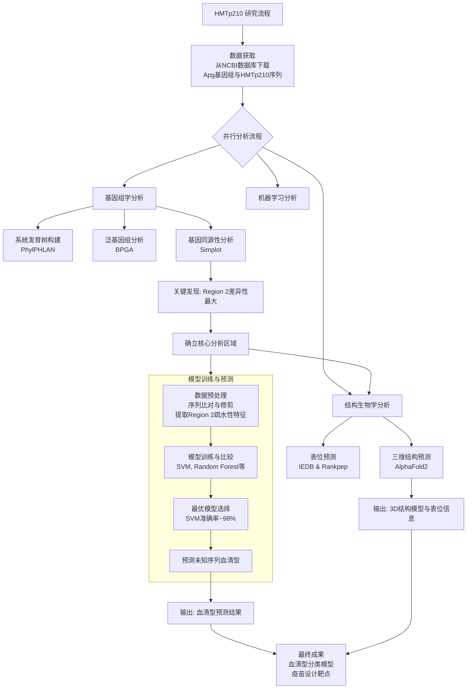

```mermaid
flowchart TD
    A[HMTp210 研究流程] --> B[数据获取<br>从NCBI数据库下载<br>Apg基因组与HMTp210序列]
    
    B --> C{并行分析流程}
    
    C --> D[基因组学分析]
    D --> D1[系统发育树构建<br>PhylPHLAN]
    D --> D2[泛基因组分析<br>BPGA]
    D --> D3[基因同源性分析<br>Simplot]
    
    C --> E[结构生物学分析]
    E --> E1[表位预测<br>IEDB & Rankpep]
    E --> E2[三维结构预测<br>AlphaFold2]
    
    C --> F[机器学习分析]
    subgraph F_sub [模型训练与预测]
        F1[数据预处理<br>序列比对与修剪<br>提取Region 2疏水性特征]
        F1 --> F2[模型训练与比较<br>SVM, Random Forest等]
        F2 --> F3[最优模型选择<br>SVM准确率~98%]
        F3 --> F4[预测未知序列血清型]
    end

    D3 --> G[关键发现: Region 2差异性最大]
    G --> H[确立核心分析区域]
    
    H --> F_sub
    H --> E
    
    F4 --> I[输出: 血清型预测结果]
    E2 --> J[输出: 3D结构模型与表位信息]
    
    I & J --> K[最终成果<br>血清型分类模型<br>疫苗设计靶点]
```