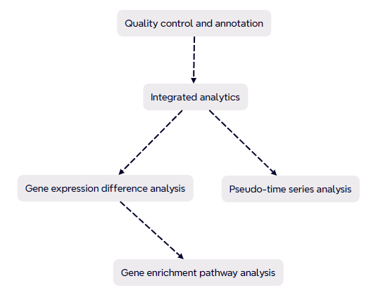

## Research Description:
• Preprocessed and clustered scRNA-seq data (16 PDAC tumors, 3 normal tissues; 16 PDAC PBMCs, 4 healthy PBMCs) using Harmony for batch correction and SingleR/Seurat v5 for annotation, to identify spatial collapse of T cells and TAM expansion associated with COL1A1-driven ECM remodeling. 

• Conducted pseudotime trajectory inference on myeloid-to-macrophage lineages via Monocle3, uncovering epigenetic silencing of cytotoxic pathways (GZMA/NKG7 downregulation) and upregulation of ribosomal biogenesis in PDAC-derived TAMs. 

• Processed and analyzed 10x Xenium FFPE spatial transcriptomic data using Squidpy + Scanpy, followed by DESeq2 and FindAllMarkers for DEG analysis, and GO/KEGG enrichment to identify key immune modulators. 

• Identified bifunctional regulatory molecules including NOP53 (activates p53, suppresses PI3K-AKT) and SPP1 (involved in both metastasis and anti-tumor immunity), and validated their spatial co-localization with TAMs and tumor cells. 
 
## Research Background and Objectives:

Pancreatic ductal adenocarcinoma (PDAC) is a highly lethal cancer with limited early diagnostic and therapeutic options. This study integrates single-cell and spatial transcriptomics to dissect the spatiotemporal heterogeneity of tumor-associated macrophages (TAMs) and their dual roles in immune suppression and tumor progression, aiming to identify novel biomarkers and therapeutic targets.

## Methods:

1.Utilized publicly available scRNA-seq and spatial transcriptomic data from GEO and 10x Genomics.

2.Integrated datasets and annotated cell types using Seurat, Harmony, and SingleR.

3.Conducted pseudotemporal trajectory analysis with Monocle3 to map macrophage differentiation.

4.Performed differential expression analysis with DESeq2 and pathway enrichment with GO/KEGG.

5.Visualized spatial gene expression patterns using Squidpy.

## Key Findings:

1.T-cells showed restricted spatial distribution in PDAC, while macrophages expanded, indicating impaired immune surveillance.

2.Pseudotime analysis revealed myeloid progenitor differentiation into monocytes/macrophages, with cytotoxic pathways suppressed in PDAC TAMs.

3.Identified tissue-specific markers: LCN2 in healthy tissues, CTRB1/AMY2A in PDAC.

4.Discovered dual-function molecular hubs: NOP53 (inhibits PI3K-AKT, activates p53) and SPP1 (pro-metastatic yet immunostimulatory).

5.Spatial transcriptomics highlighted NOP53, CFB, and SPP1 as potential diagnostic biomarkers.
