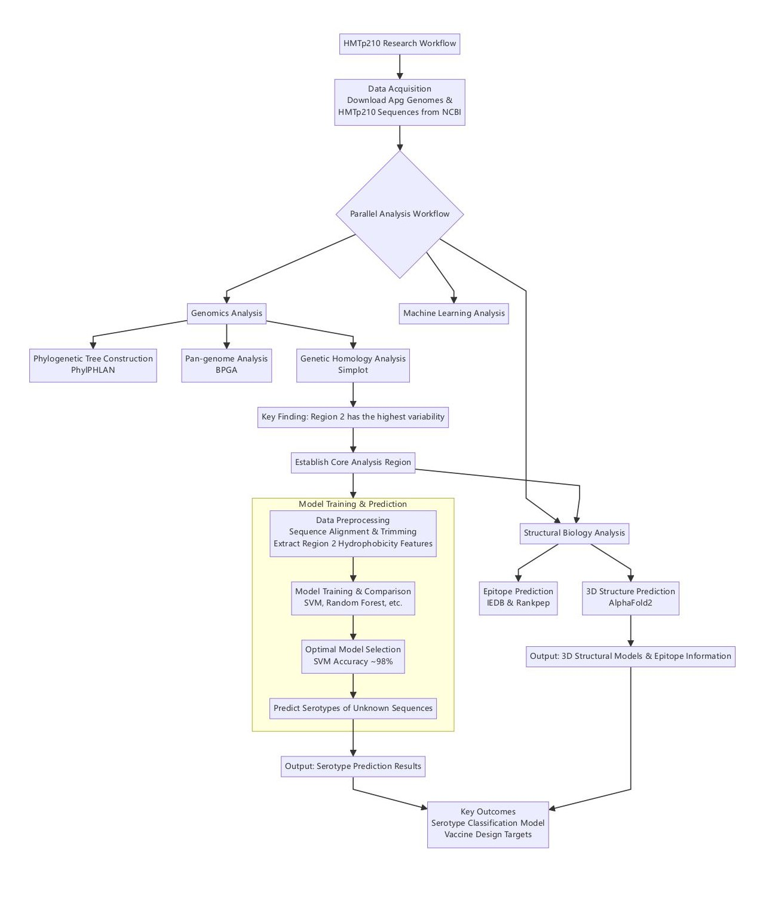

## Research Description:
• Led a full-stack genomic and structural bioinformatics analysis of HMTp210, a hemagglutinin protein from Avibacterium paragallinarum (Apg), and pioneered the sequence-based serotyping model for Apg using 91 strains from NCBI. 

• Constructed a robust serotyping framework integrating phylogenetic tree building (PhyloPhlAn), pan-genome analysis (BPGA + MAFFT), and motif detection (MEME), classifying HMTp210 into 3 major serogroups (A/B/C) and 8 subtypes (A1–C3) based on Region2-specific divergence. 

• Applied AlphaFold2 for full-length 3D structure prediction of A/B/C representatives, revealing HMTp210 as a trimeric TAA (trimeric autotransporter adhesin) with well-defined head (β-sheet), stalk (“α-helix–loop–β”) and anchor (β-barrel) domains. 

• Performed B-cell epitope prediction using IEDB and Rankpep, identifying 6 conserved immunodominant epitopes enriched in Region2/3, including a novel “clover-shaped loop” structure with >95% cross-serotype conservation. 

• Identified A-type specific epitope (1634N–1640T) and C2-subtype–unique insertions, enabling development of a motif-based subtyping model and offering theoretical groundwork for subtype-specific recombinant vaccine design. 

## Research Background and Objectives:

Avibacterium paragallinarum (Apg) is the causative agent of Infectious Coryza (IC) in chickens, leading to significant economic losses in poultry farming. Its hemagglutinin protein HMTp210, located on the outer membrane, plays a crucial role in immunogenicity and pathogenicity, can stimulate host immune responses, and is a potential subunit vaccine antigen. However, systematic research on HMTp210 is limited. This study aims to analyze the differences in HMTp210 across different serotypes from genomic and structural perspectives, exploring its potential as a basis for serotyping and a target for vaccine development.

## Methods:

1.Acquired genomic and HMTp210 sequence data of various Apg serotypes from NCBI.

2.Constructed phylogenetic trees using PhylPHLAN and pan-genomes using BPGA to analyze evolutionary relationships.

3.Performed gene homology, motif, and sequence conservation analyses using SimPlot, Jalview, MEME, and Weblogo.

4.Developed machine learning models (SVM, etc.) to predict serotypes of unknown strains based on the hydrophobicity of amino acids in HMTp210 Region 2.

5.Predicted B-cell and MHC-binding epitopes using IEDB and Rankpep.

6.Predicted the 3D structure of HMTp210 for three representative serotype strains using AlphaFold2.

## Key Findings:

1.Phylogenetic analysis based on HMTp210 clearly classified Apg into three serogroups (A, B, C) with internal subgroups (e.g., A1, A2, A3; B1, B2; C1, C2, C3).

2.The hmtp210 gene could be divided into three regions (Region1, 2, 3), with Region2 exhibiting the highest sequence divergence, making it the focus for serotype difference analysis.

3.A machine learning model (SVM) achieved ~98% accuracy in predicting serotypes based on the hydrophobicity of 267 amino acid positions in Region 2.

4.Epitope predictions (B-cell and MHC-binding) were concentrated in Region 2 and Region 3.

5.AlphaFold2 structure prediction confirmed HMTp210 is a classic trimeric autotransporter adhesin (TAA family protein). A structurally unique "Clover Loop" region was identified within the predicted epitopes, adjacent to a highly conserved area. This structure may influence immune recognition and pathogen colonization.

6.A unique insertion sequence was identified in the C2 subgroup.

