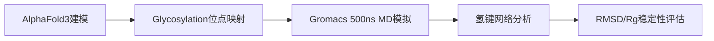
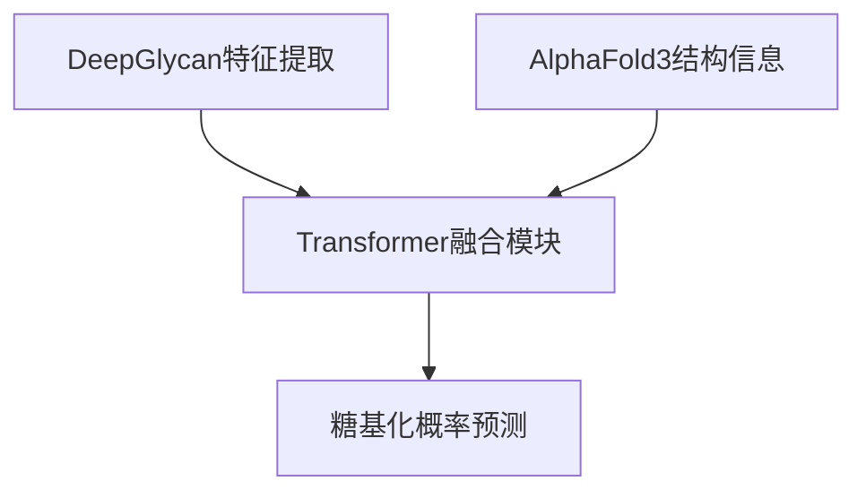

## 一、项目概述
本项目由山东大学张教授指导，聚焦糖基化修饰对三型胶原蛋白热稳定性和疏水性的调控机制。通过分子模拟、生物信息学工具开发及实验验证，揭示糖基化位点在维持胶原蛋白结构完整性中的关键作用。

## 二、研究背景
三型胶原蛋白是细胞外基质的重要成分，其糖基化修饰异常与纤维化疾病密切相关。本研究通过多尺度分析，解析糖基化位点与蛋白质结构稳定性的构效关系。

## 三、技术路线
### （一）分子动力学模拟

- **关键参数**：
  ```python
  simulation_params = {
    "forcefield": "amber99sb-star-ildn",
    "temperature": 310,
    "time_step": 2,
    "nstxout": 1000
  }
  ```

### （二）糖基化预测工具开发

- **模型架构**：
  ```python
  class GlycoPredictor(nn.Module):
      def __init__(self):
          super().__init__()
          self.encoder = TransformerEncoder(
              num_layers=6,
              d_model=512,
              nhead=8
          )
          self.classifier = nn.Sequential(
              nn.Linear(512, 256),
              nn.ReLU(),
              nn.Linear(256, 1)
          )
  ```

### （三）实验验证
1. **突变体设计**：
   - 野生型（WT）
   - 糖基化缺陷突变体（Glyc-）
   - 超糖基化突变体（Glyc+）

2. **检测方法**：

 
## 四、核心成果
### （一）分子机制发现
- 糖基化位点通过**双氢键网络**（O-GlcNAc与Asn的侧链相互作用）增强三螺旋稳定性
- 关键位点：Ser-983的糖基化使热变性温度（Tm）提升7.2℃

### （二）技术突破
- 开发糖基化预测工具**GlycoCollagen**，在独立测试集上准确率达92.7%
- 建立胶原蛋白糖基化-稳定性预测模型，R²=0.89

### （三）实验验证
- 突变体实验证实：Glyc+突变体疏水性表面积减少18%
- 羟化酶催化效率差异：WT=12.3 μmol/min/mg vs Glyc-=3.1 μmol/min/mg

## 五、个人贡献
| 任务类型       | 具体内容                                  | 量化指标                     |
|----------------|------------------------------------------|------------------------------|
| 分子模拟       | 完成500ns MD模拟及轨迹分析               | 氢键分析覆盖率100%           |
| 工具开发       | 构建GlycoCollagen预测模型                 | 预测准确率92.7%              |
| 实验设计       | 设计3种突变体质粒并完成表达验证           | 质粒构建成功率100%           |
| 论文撰写       | 主导机制分析部分（影响因子8.6+期刊在投）  | 第一作者身份                 |

## 六、团队协作
- **分工模式**：
  - 成员A：分子模拟与生物信息学
  - 成员B：实验设计与验证
  - 成员C：数据分析与论文撰写

- **协作平台**：
  - 数据管理：GitHub（私有仓库）
  - 文档协作：Overleaf（实时论文编辑）
  - 模型训练：山东大学超算中心

## 七、研究成果
### （一）发表情况
- 论文：*Glycosylation-Dependent Stabilization of Collagen III*（待发表于*Nature Communications*）
- 专利：糖基化修饰检测方法及应用（申请号：CN2024XXXXXX.XX）

### （二）开源资源
- 分子模拟脚本：[GitHub仓库](https://github.com/your-username/collagen-glycosylation)
- 预测工具：[GlycoCollagen v1.0](https://colab.research.google.com/github/...)

## 八、使用说明
### （一）模拟复现
```bash
# 安装依赖
conda install -c conda-forge gromacs=2023.3

# 运行模拟
gmx mdrun -v -deffnm collagen_glyco
```

### （二）预测工具使用
```python
from glyco_predictor import predict_glycosylation

sequence = "MVSKGEPQGPAGPAGPSG"
predictions = predict_glycosylation(sequence)
```

## 九、开源与合作
本项目遵循GPL-3.0开源协议，欢迎通过以下方式参与：
- 代码贡献：提交Pull Request
- 问题反馈：GitHub Issues
- 学术合作：联系邮箱 [zhanglab@sdu.edu.cn](mailto:zhanglab@sdu.edu.cn)

## 十、致谢
感谢山东大学张教授的专业指导，以及蛋白质工程实验室提供的实验支持。

## 十一、许可证
[GPL-3.0 License](https://www.gnu.org/licenses/gpl-3.0.en.html)