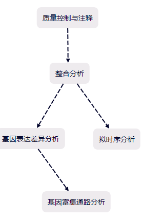

## 项目描述:
• 使用 Harmony 进行批次校正，并使用 SingleR/Seurat v5 进行细胞注释，对 scRNA-seq 数据（16个PDAC肿瘤，3个正常组织；16个PDAC PBMCs，4个健康PBMCs）进行预处理和聚类，以识别与 COL1A1 驱动的 ECM 重塑相关的 T 细胞空间塌陷和 TAM 扩增。

• 通过 Monocle3 对髓系-巨噬细胞谱系进行拟时序轨迹推断，揭示了 PDAC 来源的 TAM 中细胞毒性通路（GZMA/NKG7 下调）的表观遗传沉默和核糖体生物合成的上调。

• 使用 Squidpy + Scanpy 处理和分析 10x Xenium FFPE 空间转录组数据，随后使用 DESeq2 和 FindAllMarkers 进行差异表达基因（DEG）分析，并进行 GO/KEGG 富集分析以鉴定关键免疫调节因子。

• 鉴定出包括 NOP53（激活 p53，抑制 PI3K-AKT）和 SPP1（参与转移和抗肿瘤免疫）在内的双功能调节分子，并验证了它们与 TAM 和肿瘤细胞的空间共定位。
 
## 研究背景与目的:

胰腺导管腺癌（PDAC）是一种死亡率极高的癌症，缺乏早期诊断方法和有效治疗手段。本研究旨在通过整合单细胞转录组和空间转录组技术，揭示PDAC中肿瘤相关巨噬细胞（TAMs）的时空异质性及其在免疫抑制和肿瘤进展中的双重作用，为早期诊断和治疗提供新靶点。

## 研究方法:

1.使用来自GEO和10x Genomics的公开单细胞与空间转录组数据。

2.利用Seurat、Harmony、SingleR等进行数据整合与细胞注释。

3.应用Monocle3进行伪时间轨迹分析，揭示巨噬细胞分化路径。

4.使用DESeq2进行差异表达分析，GO/KEGG进行通路富集分析。

5.通过Squidpy进行空间基因表达可视化。

## 主要发现:

1.PDAC组织中T细胞空间分布受限，巨噬细胞分布扩展，提示免疫监视受损。

2.伪时间分析显示髓系祖细胞分化为单核/巨噬细胞，PDAC巨噬细胞中细胞毒性通路（如GZMA/NKG7）被抑制。

3.鉴定出组织特异性标志物（如LCN2在健康组织，CTRB1/AMY2A在PDAC）。

4.发现NOP53和SPP1作为双重功能分子节点：NOP53抑制PI3K-AKT并激活p53；SPP1既促进转移又可能增强抗肿瘤免疫。

5.空间转录组显示NOP53、CFB、SPP1等高表达，提示其作为PDAC诊断标志物的潜力。

