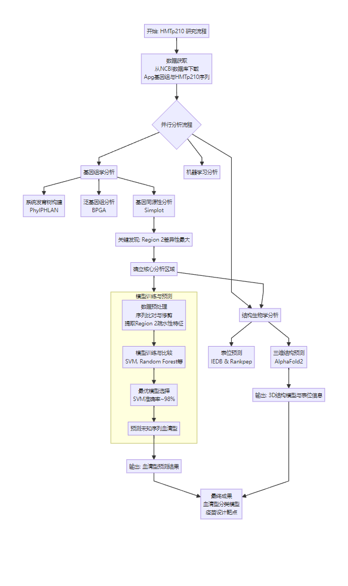

## 项目描述:

• 主导了对副鸡禽杆菌（Apg）血凝素蛋白 HMTp210 的全栈基因组和结构生物信息学分析，并利用来自 NCBI 的 91 个菌株，使用了基于序列的 Apg 血清分型模型。

• 构建了一个强大的血清分型框架，整合了系统发育树构建（PhyloPhlAn）、泛基因组分析（BPGA + MAFFT）和基序检测（MEME），根据 Region2 的特异性差异将 HMTp210 分为 3 个主要血清群（A/B/C）和 8 个亚型（A1–C3）。

• 应用 AlphaFold2 对 A/B/C 代表株进行全长 3D 结构预测，揭示 HMTp210 是一个三聚体 TAA（三聚体自转运粘附素），具有明确的头（β-折叠）、茎（“α-螺旋-环-β”）和锚（β-桶）结构域。

• 使用 IEDB 和 Rankpep 进行 B 细胞表位预测，鉴定出 6 个富集在 Region2/3 的保守免疫优势表位，包括一个具有 >95% 交叉血清型保守性的新型“三叶草形环”结构。

• 鉴定了 A 型特异性表位（1634N–1640T）和 C2 亚型特异性插入，从而能够开发基于基序的亚分型模型，并为亚型特异性重组疫苗设计提供理论基础。

## 研究背景与目的:

禽副鸡杆菌（Avibacterium paragallinarum, Apg）是鸡传染性鼻炎（Infectious Coryza, IC）的病原体，对家禽业造成巨大经济损失。其血凝素蛋白HMTp210位于细菌最外层，在免疫原性和致病性中起关键作用，并能刺激宿主免疫反应，是潜在的亚单位疫苗抗原。然而，目前对HMTp210的系统性研究较少。本研究旨在从基因组和结构基因组学角度分析不同血清型Apg血凝素蛋白HMTp210的差异，探索其作为分型基础和疫苗开发靶点的潜力。

## 研究方法:

1.从NCBI获取不同血清型Apg菌株的基因组和HMTp210序列。

2.使用PhylPHLAN构建系统发育树，BPGA构建泛基因组，分析进化关系。

3.利用SimPlot、Jalview、MEME、Weblogo进行基因同源性、 motif 和序列保守性分析。

4.开发机器学习模型（SVM等），基于HMTp210 Region 2的氨基酸疏水性预测未知菌株的血清型。

5.使用IEDB和Rankpep进行B细胞和MHC结合表位预测。

6.应用AlphaFold2预测三种典型血清型菌株的HMTp210三维结构。

## 主要发现:

1.基于HMTp210的系统发育树可将Apg清晰地分为A、B、C三个血清群，且群内存在亚群（如A1, A2, A3; B1, B2; C1, C2, C3）。

2.HMTp210基因可分为三个区域（Region1, 2, 3），其中Region2序列差异性最大，是血清型差异分析的重点。

3.机器学习模型（SVM）基于Region 2的267个氨基酸疏水性特征，能以约98%的准确率预测血清型。

4.表位预测（B细胞和MHC结合表位）主要集中在Region 2和Region 3。

5.使用IEDB和Rankpep进行B细胞和MHC结合表位预测。

6.应用AlphaFold2预测三种典型血清型菌株的HMTp210三维结构。AlphaFold2结构预测证实HMTp210是典型的三聚体自转运粘附素（TAAs家族蛋白）。在预测的表位区域内发现了一个结构独特的“三叶草Loop区”（Clover Loop），其附近存在一个高度保守区域，该结构可能影响免疫识别和病原体定植。

7.发现C2亚群中存在一个特殊的插入序列。

