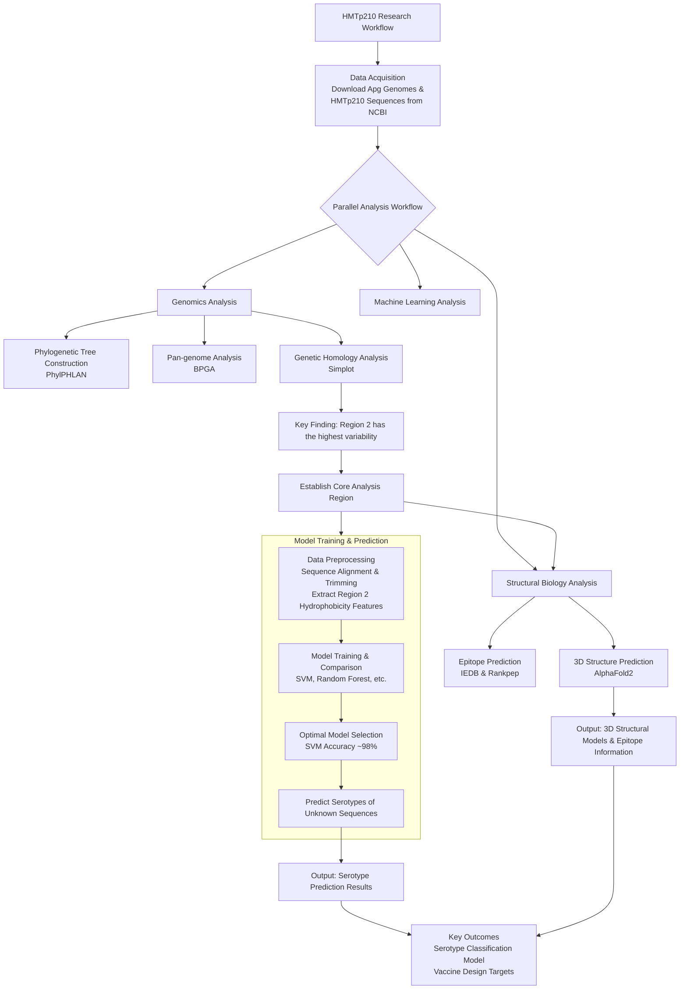

```mermaid
flowchart TD
    A[HMTp210 Research Workflow] --> B[Data Acquisition<br>Download Apg Genomes &<br>HMTp210 Sequences from NCBI]
    
    B --> C{Parallel Analysis Workflow}
    
    C --> D[Genomics Analysis]
    D --> D1[Phylogenetic Tree Construction<br>PhylPHLAN]
    D --> D2[Pan-genome Analysis<br>BPGA]
    D --> D3[Genetic Homology Analysis<br>Simplot]
    
    C --> E[Structural Biology Analysis]
    E --> E1[Epitope Prediction<br>IEDB & Rankpep]
    E --> E2[3D Structure Prediction<br>AlphaFold2]
    
    C --> F[Machine Learning Analysis]
    subgraph F_sub [Model Training & Prediction]
        F1[Data Preprocessing<br>Sequence Alignment & Trimming<br>Extract Region 2 Hydrophobicity Features]
        F1 --> F2[Model Training & Comparison<br>SVM, Random Forest, etc.]
        F2 --> F3[Optimal Model Selection<br>SVM Accuracy ~98%]
        F3 --> F4[Predict Serotypes of Unknown Sequences]
    end

    D3 --> G[Key Finding: Region 2 has the highest variability]
    G --> H[Establish Core Analysis Region]
    
    H --> F_sub
    H --> E
    
    F4 --> I[Output: Serotype Prediction Results]
    E2 --> J[Output: 3D Structural Models & Epitope Information]
    
    I & J --> K[Key Outcomes<br>Serotype Classification Model<br>Vaccine Design Targets]
```